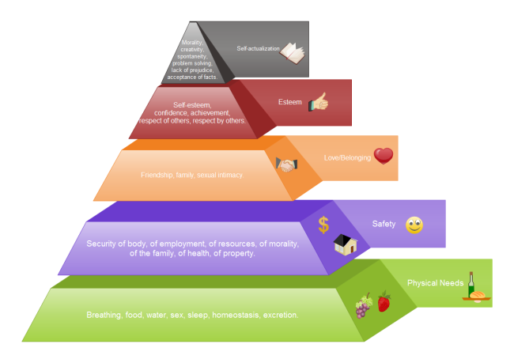
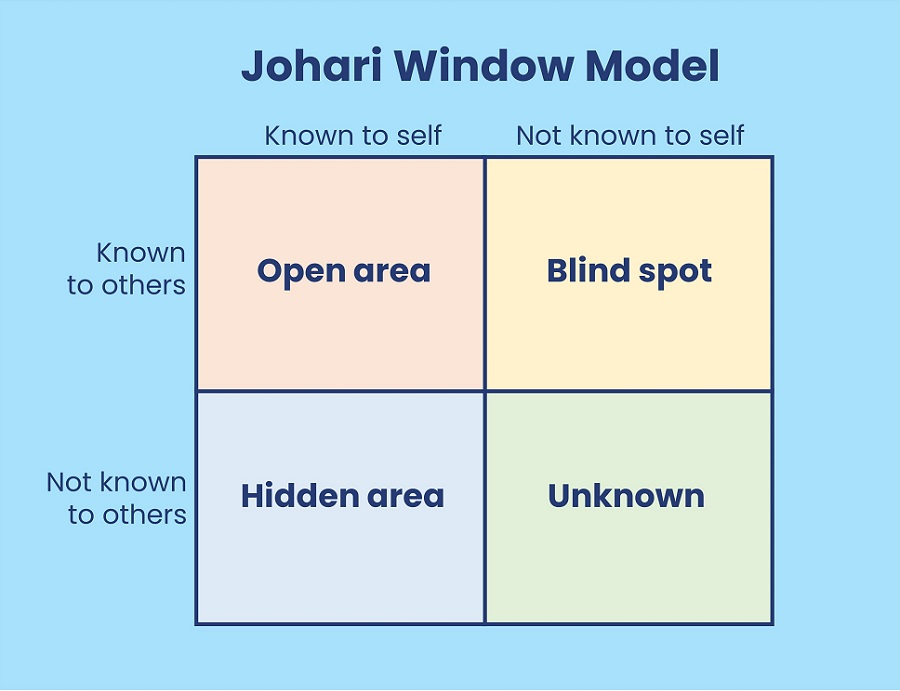

# Module 3:-

## 2 Marks:- 

### 1. Compare and contrast sensation and perception.
**Sensation**:
- **Definition**: The process of detecting and receiving stimuli from the environment through sensory organs (e.g., eyes, ears, skin).
- **Involvement**: Involves the raw data that our sensory receptors pick up, such as light, sound, or touch.
- **Nature**: It is a physiological process and involves basic detection of stimuli.
- **Example**: Feeling heat from a stove or hearing a sound.

**Perception**:
- **Definition**: The process of interpreting and organizing sensory information to make sense of the world around us.
- **Involvement**: It involves the brain’s interpretation of sensory input, giving meaning to the raw data.
- **Nature**: It is a psychological process that is influenced by experiences, expectations, and context.
- **Example**: Recognizing a friend's voice or interpreting a shape as a square.

**Comparison**:
- Both are involved in understanding the environment, but sensation is about the initial reception of stimuli, while perception is about interpreting those stimuli.
  
**Contrast**:
- Sensation is the simple detection of stimuli, while perception is more complex and involves cognitive processes like interpretation and meaning-making.

---
### 2. Explain the role of digital literacy in the context of 21st-century skills.
- **Empowering Communication**: Digital literacy enables individuals to effectively communicate and collaborate using various digital platforms, crucial in a globally connected world.  
- **Enhancing Problem-Solving**: With digital tools, individuals can analyze, process, and solve problems more efficiently, using resources like data analysis software or online research.  
- **Supporting Lifelong Learning**: Digital literacy allows individuals to access educational resources and stay updated with new technologies, ensuring continuous learning and adaptation in a fast-changing world.  
- **Boosting Employment Opportunities**: Digital literacy is essential for most modern careers, helping individuals navigate technology-driven work environments and stay competitive in the job market.  
- **Promoting Critical Thinking**: Digital literacy encourages the evaluation of online information, fostering critical thinking and discernment in the face of vast digital content.  
- **Fostering Innovation**: It provides the foundation for creating new digital solutions, tools, and content, supporting innovation in various sectors.

---
### 3. Emily is a software developer with excellent coding skills but has difficulty presenting her ideas to non-technical team members. Her company is planning to launch a new project, and she sees this as an opportunity to take on a leadership role. However, her lack of communication skills might be a barrier. Perform a SWOT analysis for Emily and provide recommendations on how she can overcome her weaknesses to achieve her goal of taking on a leadership role.

Certainly! Here's a concise 2-mark answer:

### **SWOT Analysis for Emily**

**Strengths**:
- Strong coding skills and problem-solving abilities.

**Weaknesses**:
- Difficulty communicating technical ideas to non-technical team members.

**Opportunities**:
- New project offers a chance to develop leadership skills.

**Threats**:
- Miscommunication with non-technical teams could affect project success.

### **Recommendations**:
- Practice simplifying technical concepts for non-technical audiences.
- Seek mentorship or take leadership training to enhance communication and leadership skills.

---
### 4. Evaluate the relationship between self-efficacy and self-esteem, and critically discuss how self-efficacy can influence an individual's personal and professional growth.

### **Relationship Between Self-Efficacy and Self-Esteem**

- **Self-Efficacy** refers to an individual’s belief in their ability to accomplish specific tasks or handle challenges. It is task-oriented and context-specific.
- **Self-Esteem** refers to the overall sense of self-worth or value a person places on themselves, encompassing their self-judgment across different areas of life.

**Connection**: While self-efficacy focuses on one's perceived ability to succeed in specific situations, self-esteem reflects a broader sense of self-worth. High self-efficacy can contribute to higher self-esteem, as accomplishing tasks successfully boosts confidence. However, someone may have high self-esteem but low self-efficacy in certain areas, or vice versa.

---

### **How Self-Efficacy Influences Personal and Professional Growth**

- **Increases Motivation**: Believing in one's ability to succeed increases effort, perseverance, and persistence, which drives personal and professional growth.
- **Enhances Goal Setting**: High self-efficacy encourages individuals to set more challenging and meaningful goals, pushing them to achieve higher standards.
- **Improves Resilience**: Those with high self-efficacy are more likely to bounce back from setbacks, using challenges as learning experiences rather than obstacles.
- **Facilitates Skill Development**: Self-efficacy fosters the confidence needed to acquire and refine new skills, leading to greater competence and success in both personal and professional contexts.

---
### 5. State some barriers to effective listening with appropriate examples
### **Barriers to Effective Listening**

1. **Distractions**:
   - **Example**: A person may struggle to listen effectively if they are distracted by background noise, such as a phone ringing or people talking around them.

2. **Prejudices or Biases**:
   - **Example**: If a listener has preconceived notions about the speaker, they may ignore important points or misinterpret the message, such as dismissing a colleague's ideas because of their position.

3. **Emotional Barriers**:
   - **Example**: If a person is feeling stressed or upset, they might find it hard to focus on what the speaker is saying, potentially leading to missed information.

4. **Poor Listening Environment**:
   - **Example**: A noisy office or a poorly lit room can make it difficult to concentrate on the speaker, impacting effective listening.

5. **Lack of Interest or Motivation**:
   - **Example**: If the topic of conversation is unengaging or irrelevant to the listener, they may tune out and stop paying attention to the speaker.

6. **Language or Vocabulary Differences**:
   - **Example**: If a speaker uses technical jargon or unfamiliar terms, the listener might struggle to understand and interpret the message correctly.

7. **Physical Barriers**:
   - **Example**: Hearing impairments or issues with speech clarity can prevent effective communication, making it difficult to listen accurately.

---
### 7. Diagrammatically represent Maslow's "Hierarchy of Needs".

---

## 5-Marks

### 1. Freud proposed that the mind is divided into three components and the interactions and conflicts among the components create personality. Keeping this statement in view explain these components with real-time examples.
- **Id**:  
  - The primal, unconscious part of the mind that seeks immediate pleasure and avoids pain, driven by basic instincts and desires.  
  - **Example**: A child crying for a toy immediately without thinking about others' feelings, as the id desires instant gratification.

- **Ego**:  
  - The rational part of the mind that mediates between the desires of the id and the constraints of reality, making realistic decisions.  
  - **Example**: A person might desire to quit their job (id), but their ego considers responsibilities like paying bills and decides to stay.

- **Superego**:  
  - The moral compass of the mind, representing societal norms and values, often imposing guilt and shame when one deviates from these standards.  
  - **Example**: A person feels guilty for lying, as the superego reminds them of ethical standards and personal integrity.  

The interaction between these components influences behavior and personality, with the ego constantly balancing the demands of the id and superego.

---
### 2. Analyze how the Johari Window model can be applied to enhance communication within a team. What strategies would you recommend to expand the 'Open Area' while minimizing the 'Blind Spot' and 'Hidden Area?
- **Johari Window Model Overview**:  
  - The Johari Window consists of four quadrants:  
    - **Open Area** (known to self and others)  
    - **Blind Spot** (known to others but not self)  
    - **Hidden Area** (known to self but not others)  
    - **Unknown Area** (unknown to both self and others)  

    

- **Enhancing Communication**:  
  - **Open Area**: Expanding this area improves mutual understanding, fosters trust, and encourages open communication within the team.  
  - **Blind Spot**: Reducing blind spots helps individuals become more self-aware and receptive to feedback, enhancing collaboration.  
  - **Hidden Area**: Reducing the hidden area involves increasing vulnerability, which builds stronger relationships and enhances transparency.

- **Strategies to Expand the 'Open Area'**:  
  - **Encourage Regular Feedback**: Promote a culture of constructive feedback where team members openly share observations and suggestions.  
  - **Share Information Freely**: Regularly exchange information, goals, and progress updates to ensure everyone is aligned and understands each other's strengths and weaknesses.  
  - **Foster Open Discussions**: Hold team meetings where individuals feel safe to express opinions, ideas, and concerns without fear of judgment.  

- **Strategies to Minimize the 'Blind Spot'**:  
  - **Request Feedback**: Encourage team members to ask for feedback from others on their performance and behavior.  
  - **Self-Reflection**: Regular self-reflection helps individuals recognize areas they may not be aware of, which reduces blind spots.  
  - **360-Degree Feedback**: Implement a formal 360-degree feedback process where team members receive feedback from peers, subordinates, and managers.  

- **Strategies to Minimize the 'Hidden Area'**:  
  - **Promote Vulnerability**: Encourage team members to share personal experiences, challenges, and emotions to build trust and reduce hidden areas.  
  - **Build Safe Environments**: Create a psychologically safe environment where individuals feel comfortable disclosing information without fear of negative consequences.  
  - **Mentorship and Coaching**: Pair team members with mentors or coaches to help them open up and share more about themselves in a structured way.  

By actively working on these strategies, teams can enhance communication, improve collaboration, and foster a culture of openness and trust.

---
### 3. What are the various steps involved in the process of career planning?

- **Self-Assessment**:  
  - Evaluate personal strengths, weaknesses, interests, values, and skills.  
  - Identify what motivates you and what kind of work environment you thrive in.  
  - **Example**: Taking career aptitude tests or reflecting on past job experiences to determine what aspects you enjoy the most.  

- **Setting Career Goals**:  
  - Define clear, short-term and long-term career objectives based on your skills and interests.  
  - Make sure goals are SMART (Specific, Measurable, Achievable, Relevant, Time-bound).  
  - **Example**: A short-term goal could be gaining a certain certification, while a long-term goal could involve becoming a manager in the chosen field.  

- **Exploring Career Options**:  
  - Research different industries, job roles, and career paths that align with your goals and interests.  
  - **Example**: Researching roles in AI & ML for someone interested in technology, or considering managerial positions if leadership is a goal.  

- **Developing Skills and Qualifications**:  
  - Identify the skills, qualifications, or certifications needed to pursue chosen career options.  
  - **Example**: Enrolling in relevant courses, gaining internships, or obtaining certifications (e.g., Data Science for an AI career).  

- **Networking**:  
  - Build and maintain professional relationships with people in your chosen field.  
  - Attend industry events, seminars, and webinars, and connect with professionals on platforms like LinkedIn.  
  - **Example**: Joining professional organizations or reaching out to mentors in your field for advice and guidance.  

- **Gaining Experience**:  
  - Seek internships, part-time roles, or volunteering opportunities to gain hands-on experience and build a strong portfolio.  
  - **Example**: Interning at a tech company for experience in coding or AI development.  

- **Evaluating and Reassessing Goals**:  
  - Periodically review progress towards your career goals and make adjustments as needed based on changing interests, market trends, or personal circumstances.  
  - **Example**: Reassessing a goal if you realize a new field or role aligns more with your evolving interests.  

- **Job Search and Interviewing**:  
  - Apply for relevant positions, tailor resumes, and prepare for interviews.  
  - **Example**: Leveraging job boards, career fairs, or recruiter connections to find the best fit for your skills and goals.  

- **Continuous Learning and Growth**:  
  - Keep up with industry trends and continue to develop new skills throughout your career.  
  - **Example**: Taking advanced courses, attending workshops, and staying updated with new tools and technologies relevant to your profession.  

This structured process helps individuals align their career choices with personal aspirations and market needs, paving the way for long-term professional success.

---
### 4. Imagine you are leading a team in a rapidly changing industry. One of your main challenges is ensuring that your team remains competitive and innovative. Based on the concept of 21st-century skills, propose a plan for upskilling your team. Explain how you would implement this plan and the expected outcomes.

**Plan for Upskilling the Team Based on 21st-Century Skills**:

- **1. Identify Key 21st-Century Skills**:  
  - Focus on essential skills for innovation and competitiveness, such as **critical thinking**, **creativity**, **collaboration**, **communication**, **digital literacy**, **problem-solving**, and **adaptability**.  
  - **Example**: In a rapidly changing industry like AI, technical skills (e.g., machine learning, data science) and soft skills (e.g., teamwork, innovation) should be prioritized.  

- **2. Conduct Skills Assessment**:  
  - Evaluate current skill levels within the team to identify gaps and areas for growth. This can be done through surveys, performance reviews, and one-on-one meetings.  
  - **Example**: Assess the team’s proficiency in emerging technologies, collaboration tools, and critical thinking capabilities.  

- **3. Design a Tailored Upskilling Program**:  
  - Create a blend of **formal training** (e.g., online courses, certifications) and **informal learning** (e.g., peer mentorship, knowledge sharing).  
  - Offer specialized learning paths in areas such as **coding and automation** for technical roles and **leadership development** for managerial staff.  
  - **Example**: Team members interested in AI could take an online course on neural networks, while those in leadership positions could participate in workshops on adaptive leadership.  

- **4. Promote Cross-Functional Collaboration**:  
  - Encourage team members from different departments to collaborate on projects to broaden skillsets and improve problem-solving capabilities.  
  - Foster an **innovation culture** where brainstorming and experimenting are encouraged.  
  - **Example**: Pair a software developer with a marketing expert to work on an AI-driven customer service project, enhancing both technical and business acumen.  

- **5. Establish Ongoing Learning and Feedback Loops**:  
  - Implement a continuous feedback mechanism to track progress and provide constructive feedback on individual growth.  
  - Encourage regular learning sessions such as **lunch-and-learns** or **hackathons** to integrate new ideas and skills.  
  - **Example**: Monthly team meetings to discuss the latest trends, share knowledge from new courses, and showcase innovative ideas.  

- **6. Encourage Digital Tools and Platforms**:  
  - Equip the team with the necessary tools and resources for efficient learning and collaboration.  
  - **Example**: Provide access to platforms like LinkedIn Learning, Coursera, or GitHub for technical resources, while also using project management tools (e.g., Trello, Slack) for streamlined collaboration.  

**Implementation Steps**:
1. **Kick-off Meeting**:  
   - Communicate the importance of upskilling and 21st-century skills to the team.  
   - Discuss the plan, timeline, and expected outcomes, ensuring alignment with team goals and individual aspirations.  

2. **Set Learning Milestones**:  
   - Establish clear, measurable objectives for the upskilling journey (e.g., completion of specific courses, project involvement).  

3. **Create a Support System**:  
   - Assign mentors to guide team members through their upskilling process, offering support and advice.  

4. **Evaluate and Reward Progress**:  
   - Recognize and reward team members who complete significant milestones or demonstrate new skills in their work.  

**Expected Outcomes**:
- **Increased Innovation**:  
  - By continuously developing new skills, the team will generate more creative solutions and adapt to industry changes faster.  
  - **Example**: Introduction of AI-driven features in products that outpace competitors due to newly acquired technical expertise.  

- **Improved Team Collaboration**:  
  - Upskilling in areas such as communication and collaboration will lead to more effective teamwork and shared knowledge.  
  - **Example**: Enhanced cross-departmental collaboration on projects, improving the quality and speed of execution.  

- **Greater Adaptability**:  
  - With a focus on adaptability and digital literacy, the team will be better equipped to respond to changes in technology or market demands.  
  - **Example**: The team quickly transitions to a new software platform or work process as industry standards evolve.  

- **Competitive Edge**:  
  - The team’s improved skills will enhance productivity, efficiency, and the ability to innovate, keeping the organization ahead of competitors.  
  - **Example**: Development of unique products or services that differentiate the company in a crowded marketplace.  

This comprehensive upskilling plan, centered around 21st-century skills, will help the team stay competitive, foster a culture of continuous learning, and drive innovation in a rapidly evolving industry.

---
### 5. Define self-awareness and explain its importance in personal as well as professional growth.
- **Self-Awareness**:  
  - Self-awareness is the ability to recognize and understand one's emotions, thoughts, behaviors, and how they influence interactions with others. It involves being mindful of personal strengths, weaknesses, values, and motivations.  

- **Importance in Personal Growth**:  
  - **Improved Emotional Regulation**: Self-awareness allows individuals to better manage their emotions, leading to better decision-making and healthier relationships.  
    - **Example**: Being aware of feelings of frustration allows a person to take a step back and choose to respond calmly, avoiding impulsive reactions.  
  - **Personal Accountability**: It fosters a sense of responsibility for one’s actions, helping individuals learn from mistakes and make continuous improvements.  
    - **Example**: A person realizes they tend to procrastinate and can implement strategies to improve time management.  

- **Importance in Professional Growth**:  
  - **Enhanced Communication Skills**: Self-awareness helps individuals communicate more effectively by understanding how their words and actions affect others.  
    - **Example**: A leader who understands their dominant communication style can adjust it to better align with the preferences of their team, fostering clearer communication.  
  - **Career Development**: Being self-aware enables professionals to identify their strengths and areas for improvement, guiding career decisions and helping set realistic goals.  
    - **Example**: A professional might realize they excel at leadership and pursue further leadership development opportunities to advance in their career.  
  - **Better Conflict Resolution**: Self-awareness helps individuals recognize their own biases or triggers, allowing for more effective conflict resolution in the workplace.  
    - **Example**: Understanding that you tend to be defensive can help you approach a workplace conflict more openly and without defensiveness, leading to better resolutions.  

In both personal and professional contexts, self-awareness is a foundational skill that leads to better decision-making, stronger relationships, and a continuous path of growth and development.

---
### 6. Discuss the significance of note-taking as a study strategy. Explain at least two effective note-taking methods and their benefits.
- **Significance of Note-Taking as a Study Strategy**:  
  - Note-taking is an essential study strategy that helps in organizing and retaining information, improving focus during lectures or reading sessions, and providing an effective review tool. It encourages active listening, critical thinking, and engagement with the material, making it easier to understand and recall information.  
  - **Example**: Research shows that students who take notes during lectures tend to perform better on exams because they engage with the material more actively than those who do not take notes.  

- **Effective Note-Taking Methods**:

  1. **The Cornell Method**:  
     - The Cornell Method divides the page into three sections: a narrow left-hand column for key points or questions, a wide right-hand column for detailed notes, and a bottom section for summarizing key concepts.  
     - **Benefits**:  
       - It encourages active listening by requiring students to summarize material, helping with comprehension and retention.  
       - The format allows for quick review, as key points and summaries are easily accessible.  
       - **Example**: During a lecture, the student takes detailed notes in the right column, writes questions or keywords in the left column, and writes a summary at the bottom to reinforce learning.  

  2. **Mind Mapping**:  
     - Mind mapping involves creating a visual diagram where the main topic is at the center, and branches represent related concepts, subtopics, and ideas.  
     - **Benefits**:  
       - It helps organize complex information visually, making it easier to see connections between ideas.  
       - Mind maps enhance creativity and promote a deeper understanding of how topics are interrelated.  
       - **Example**: For a history class, a student might create a mind map with "World War II" in the center, with branches for key events, countries involved, and outcomes, allowing for a holistic understanding of the subject.  

Both methods improve retention, help in structuring information, and support active learning, making them effective tools for studying and mastering content.

---
### 7. Define Perceptual errors. Elaboarate on the different types of perceptual errors by giving examples to substantiate your argument.

- **Perceptual Errors**:  
  - Perceptual errors occur when an individual’s perception of a situation, person, or event is distorted or inaccurate. These errors stem from biases, misinterpretations, or preconceived notions, leading to incorrect conclusions or judgments. Such errors affect how people perceive and respond to the world around them, potentially leading to poor decision-making and interpersonal misunderstandings.

- **Types of Perceptual Errors**:

  1. **Halo Effect**:  
     - This error occurs when an individual's overall impression of someone influences their judgment of that person's specific traits or actions. A positive or negative characteristic clouds the perception of other unrelated qualities.  
     - **Example**: If an employee is highly skilled at one task, a manager might perceive them as capable in all aspects of work, even though they may struggle in other areas, like communication.  

  2. **Stereotyping**:  
     - Stereotyping involves making generalized assumptions about individuals based on their group affiliation (e.g., gender, race, age, etc.), rather than evaluating them as individuals.  
     - **Example**: Assuming that a young employee lacks experience or that older employees are resistant to new technologies based solely on their age, without considering their actual capabilities.  

  3. **Projection**:  
     - This occurs when an individual attributes their own feelings, thoughts, or motives to others, assuming that others think and behave the same way they do.  
     - **Example**: A manager who feels insecure about their own performance might assume that their team members are equally anxious or dissatisfied, without any evidence to support that assumption.  

  4. **Contrast Effect**:  
     - The contrast effect happens when people evaluate someone’s traits by comparing them to others, rather than assessing them independently. This comparison can lead to distorted perceptions.  
     - **Example**: If a job candidate is interviewed immediately after a highly impressive applicant, they may be perceived as underperforming, even if their qualifications are equally strong.  

  5. **Attribution Error**:  
     - This occurs when an individual attributes someone’s behavior to internal factors (like personality or character) rather than considering external factors (like circumstances or environment) that may have influenced their actions.  
     - **Example**: If a colleague misses a deadline, one might attribute it to their lack of commitment or incompetence, instead of considering external factors like workload or personal challenges.  

  6. **Recency Effect**:  
     - The recency effect occurs when recent information disproportionately influences one's perception or judgment, overshadowing earlier impressions or facts.  
     - **Example**: A manager might rate an employee poorly in a performance review because of a recent mistake, despite their overall strong performance over the past year.  

  7. **First Impression Error**:  
     - First impression error happens when people base their perception of someone on initial interactions or encounters, which can lead to misjudgments that persist over time.  
     - **Example**: A new team member might be perceived as unfriendly if their first day at work was filled with stress, even though they are typically sociable and approachable.  

Understanding and mitigating perceptual errors is crucial in both personal and professional settings, as these errors can lead to misunderstandings, biased decisions, and strained relationships.

---

## 10-Marks

### 1. What are the primary theories that explain the phenomenon of forgetting?
Critically analyze Freud's Iceberg theory. Explain the concepts of the conscious, preconscious, and unconscious mind, providing examples of each. Discuss their roles in personality development and their dynamic interactions. How do these components contribute to both healthy and unhealthy psychological functioning?

The phenomenon of forgetting has been studied extensively, and several theories have been proposed to explain why we forget information. The primary theories include:

### 1. **Decay Theory**
   - **Explanation**: The decay theory suggests that memories fade over time if they are not rehearsed or used. It posits that the physical trace of a memory in the brain gradually weakens, leading to forgetting.
   - **Example**: If you learn a new phone number but don't use it for a while, you might forget it as time passes.

### 2. **Interference Theory**
   - **Explanation**: According to interference theory, forgetting occurs because other memories interfere with the retrieval of the target memory. It is divided into two types:
     - **Proactive interference**: Older memories interfere with the recall of newer information.
     - **Retroactive interference**: Newer information interferes with the recall of older memories.
   - **Example**: If you recently moved to a new address, you might struggle to remember your old address (retroactive interference) or you might forget a new address because you keep recalling the old one (proactive interference).

### 3. **Retrieval Failure Theory**
   - **Explanation**: This theory suggests that forgetting is due to the inability to access stored memories, even though they are still present in the brain. A failure in the retrieval cues or context can lead to forgetting.
   - **Example**: You may remember someone's face but forget their name because you lack the appropriate cues to retrieve it.

### 4. **Motivated Forgetting (Repression)**
   - **Explanation**: This theory, particularly associated with Freudian psychoanalysis, suggests that forgetting occurs because the brain actively represses memories that are distressing, traumatic, or anxiety-inducing.
   - **Example**: Someone may forget a traumatic childhood event because their mind represses the memory to protect them from emotional pain.

### 5. **Context-Dependent Forgetting**
   - **Explanation**: This theory suggests that forgetting occurs when the context or environment in which a memory was encoded differs from the context in which it is being recalled, leading to difficulty in retrieving the memory.
   - **Example**: You might forget something you were going to say as soon as you leave the room where you had been thinking about it.

### 6. **Trace Consolidation Theory**
   - **Explanation**: According to this theory, forgetting occurs when the memory trace has not fully consolidated in the brain. Memories that are weakly encoded or poorly consolidated may fade over time.
   - **Example**: A new piece of information learned under stress or in a distracted state may be more likely to be forgotten as the memory trace wasn’t properly encoded.

### 7. **Encoding Failure Theory**
   - **Explanation**: This theory suggests that forgetting is due to a failure to properly encode the information in the first place. If information is not deeply processed or given sufficient attention during encoding, it may never be stored in long-term memory.
   - **Example**: You may forget the name of someone you briefly met at a party because you did not pay enough attention when they introduced themselves.

In summary, the primary theories explaining forgetting include decay, interference, retrieval failure, motivated forgetting, context-dependent forgetting, trace consolidation, and encoding failure. Each theory offers a different perspective on why and how information is forgotten, based on factors like time, interference, emotional content, and the process of encoding and retrieval.

---
### 2. Critically analyze Freud's Iceberg theory. Explain the concepts of the conscious, preconscious, and unconscious mind, providing examples of each. Discuss their roles in personality development and their dynamic interactions. How do these components contribute to both healthy and unhealthy psychological functioning?

Freud's Iceberg Theory of the mind is a metaphor that illustrates the relationship between different levels of consciousness in the human psyche. According to Freud, the mind can be divided into three main areas: the conscious, preconscious, and unconscious. These levels of awareness interact and shape an individual's personality and behavior. Let's critically analyze this theory and the concepts it introduces.

### **Freud's Iceberg Theory:**
The iceberg metaphor illustrates how much of the mind is hidden beneath the surface, similar to how the majority of an iceberg is submerged underwater. According to Freud, the conscious mind is just the tip of the iceberg, while the preconscious and unconscious are vast and hidden beneath it. Here's a breakdown of each component:

---

### 1. **Conscious Mind**
   - **Definition**: The conscious mind consists of everything we are aware of at any given moment. It includes thoughts, perceptions, and feelings that we can easily access.
   - **Example**: When you’re aware of reading this text or thinking about your plans for the day, you are using your conscious mind.
   - **Role in Personality Development**: The conscious mind is where individuals experience and engage with their surroundings. It plays a role in decision-making, reasoning, and problem-solving. However, it only represents a small fraction of the psyche and is limited in terms of capacity and access to deeper thoughts and memories.
   - **Contribution to Healthy Functioning**: The conscious mind allows individuals to make informed decisions, solve problems, and navigate their environment. It is the "rational" part of the psyche, helping individuals process immediate experiences.
   - **Contribution to Unhealthy Functioning**: When over-relied upon, the conscious mind may suppress deeper, unresolved emotions or conflicts from the unconscious, which can lead to stress or anxiety as unresolved issues are not addressed.

---

### 2. **Preconscious Mind**
   - **Definition**: The preconscious mind is the level of awareness that contains thoughts and memories that are not immediately conscious but can be brought into consciousness with effort or attention. It's the "storehouse" of memories and information.
   - **Example**: You might not be consciously thinking about your childhood home right now, but if someone mentions it, the memory can easily come to mind.
   - **Role in Personality Development**: The preconscious serves as a bridge between the conscious and unconscious minds. It stores memories and knowledge that can influence conscious thought. For instance, past experiences and learned behaviors can emerge here when needed, influencing conscious thoughts and actions.
   - **Contribution to Healthy Functioning**: The preconscious can serve as a source of helpful memories and learned behaviors that guide rational decision-making and problem-solving. It provides flexibility for individuals to switch between automatic responses and conscious reflection.
   - **Contribution to Unhealthy Functioning**: Over time, repressed memories or unresolved issues may linger in the preconscious and influence conscious thought, sometimes manifesting as Freudian slips or irrational actions, leading to confusion and inconsistency.

---

### 3. **Unconscious Mind**
   - **Definition**: The unconscious mind houses thoughts, memories, desires, and emotions that are not accessible to conscious awareness. According to Freud, these elements are often repressed due to their painful or socially unacceptable nature.
   - **Example**: Repressed memories of a traumatic event or unconscious desires may manifest as dreams, irrational fears, or defense mechanisms like projection or displacement.
   - **Role in Personality Development**: The unconscious mind is thought to significantly influence behavior and personality. Repressed conflicts and desires may shape actions, often in ways individuals are unaware of. Freud believed that unresolved unconscious conflicts could lead to neuroses and other psychological disorders.
   - **Contribution to Healthy Functioning**: When unconscious desires and memories are acknowledged and integrated (through therapy or self-awareness), individuals can achieve greater emotional balance and personal growth. For instance, repressed anger might be processed and expressed constructively.
   - **Contribution to Unhealthy Functioning**: Unresolved conflicts or repressed traumas in the unconscious mind can lead to maladaptive behaviors, anxiety, and emotional disorders. Freud argued that much of our behavior is motivated by unconscious forces, and these unresolved issues could contribute to unhealthy psychological functioning, such as phobias, compulsions, or emotional breakdowns.

---

### **Dynamic Interactions Between the Components:**

Freud emphasized the dynamic interplay between these three layers of the mind. The unconscious mind exerts a powerful influence on both the conscious and preconscious, often in subtle ways that are difficult to identify. For example:
- **Repression**: The unconscious mind represses undesirable memories or impulses that are deemed too painful or threatening. These repressed elements may occasionally emerge into the preconscious or conscious mind, but typically in disguised forms (e.g., dreams, jokes, or neurotic symptoms).
- **Defense Mechanisms**: To cope with these conflicts, the mind employs defense mechanisms (e.g., denial, projection, displacement), often influenced by unconscious desires. These mechanisms distort reality to reduce anxiety and maintain psychological stability.
  
The conflict between the conscious, preconscious, and unconscious minds is central to Freud's model of personality. The conscious mind might attempt to rationalize or suppress unconscious desires, while the unconscious might continue to exert influence, creating tension that can lead to internal conflict.

---

### **Contribution to Personality Development and Functioning:**
- **Healthy Functioning**: When there is harmony between the conscious, preconscious, and unconscious, the individual can experience healthy psychological functioning. The ability to access and integrate unconscious material through self-reflection, therapy, or insight allows for personal growth and emotional healing. 
- **Unhealthy Functioning**: When there is a breakdown in communication between these layers (e.g., unresolved conflicts in the unconscious), psychological dysfunction may arise. For example, repressed anger may manifest as passive-aggressive behavior, or an unresolved childhood trauma may result in ongoing anxiety or depression.

---

### **Criticism and Modern Relevance:**
While Freud’s Iceberg Theory and his broader psychoanalytic concepts were revolutionary in their time, they have been criticized for being overly deterministic and lacking empirical support. Modern psychology has developed more nuanced and scientifically supported models of the mind. The idea of unconscious influences still holds weight, but it is now understood in more cognitive and neurobiological terms rather than strictly Freudian psychodynamics. Nonetheless, Freud’s ideas still provide valuable insights into how unconscious processes can shape behavior and influence mental health.

In conclusion, Freud’s Iceberg Theory, though dated, provides a foundational understanding of the complexities of the human psyche and offers a lens through which we can examine the roles of conscious, preconscious, and unconscious processes in personality development. The dynamic interactions between these layers of the mind influence both healthy and unhealthy psychological functioning, underscoring the importance of self-awareness and introspection in fostering mental well-being.

---
